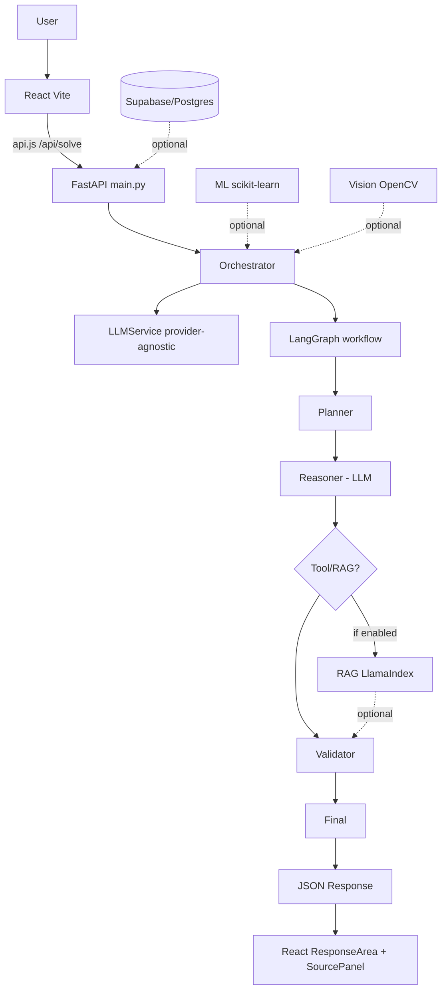

# Architecture

## Generic Stack

```
User
 ↓
React (Vite) — frontend/src/pages/Home.jsx
 ↓ fetch via centralized api.js
FastAPI — backend/app/main.py (/api/*)
 ↓
AI Orchestrator
 ├── LLMService (provider-agnostic) — backend/app/ai/llm_service.py
 │    ├── providers/mock.py
 │    ├── providers/openai.py
 │    ├── providers/groq.py
 │    ├── providers/gemini.py
 │    └── providers/anthropic.py
 ├── LangGraph Workflow — backend/app/agents/workflow.py
 │    ├── state.py (AgentState)
 │    ├── nodes.py (planner, reasoner, tool, validator, final)
 │    └── workflow.py (planner->reasoner->tool?->validator->final)
 ├── RAG (optional, LlamaIndex) — backend/app/rag/service.py
 │    └── disabled unless RAG_ENABLED=true
 ├── ML (scikit-learn) — backend/app/ml/*
 │    └── classifier.py, predictor.py, preprocessing.py
 └── Vision (optional, OpenCV) — backend/app/vision/service.py
 ↓
Validator (nodes.py validator_node)
 ↓
Response { success, answer, sources, metadata, confidence=null }
 ↓
React (ResponseArea, SourcePanel)
```

### Mermaid



*Supabase is optional - app runs without DB. LlamaIndex/HuggingFace/OpenCV are lazy.*

## Key Decisions

- **Provider-agnostic LLM**: env `LLM_PROVIDER`, `LLM_API_KEY` - no code change to switch OpenAI/Groq/Gemini.
- **LangGraph sequential fallback**: workflow runs even if `langgraph` not installed (pure async nodes).
- **RAG disabled by default**: `RAG_ENABLED=false` -> 400 if called. Keeps base install lightweight.
- **Single API contract**: frontend `services/api.js` is only fetch location.
- **Validator isolated**: `evaluation/` + `nodes.validator_node` - no factual hallucination claims.

## Request Flow Example (Agentic)

`POST /api/solve {query, context, use_rag}` -> `run_workflow(problem, context, rag_context)` -> nodes -> LLM -> validator -> JSON

## Data Optional

- RAG: `backend/app/rag/service.py` stores docs in-memory + LlamaIndex if available
- ML: templates expect `pandas.DataFrame` + `scikit-learn`
- Vision: `vision/service.py` checks `cv2` availability, returns mock if not installed
- DB: `database/service.py` returns mock when `SUPABASE_ENABLED=false`
